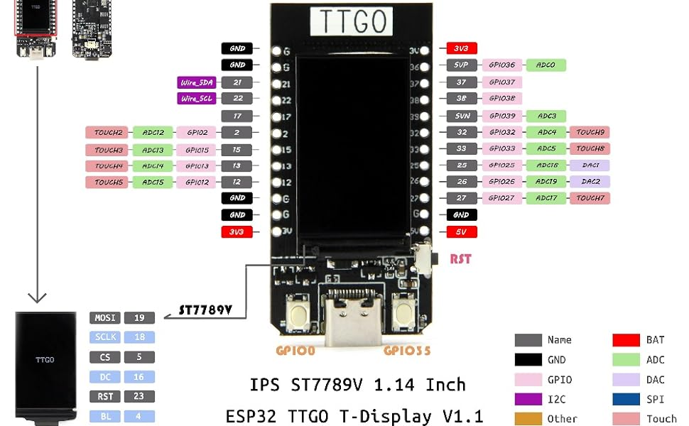

# Advanced Datatypes - Questions

---

## Question: What is an Advanced Datatype

**Short Humorous Scenario:**
Martin har netop opdaget, at der findes flere datatyper end bare `int` og `float`. Han er forvirret, fordi han troede, det var de eneste. *"Jeg ser alle disse ting kaldet structs, enums og unions. Hvad er disse? Og har jeg allerede brugt avancerede datatyper uden at vide det?"* spørger han.

**Hvad de allerede ved:**
- Basic datatypes: `int`, `float`, `char`, `double`
- Variabeldeklaration
- Arrays

**Opgaven:**

1. Definer hvad en avanceret datatype er
2. Opstil en liste over avancerede datatyper du allerede har set
3. Forklar formålet med avancerede datatyper

4. **PBL:** Martin spørger: *"Kan I tænke på en real-world analogi for en struct? Som en beholder der indeholder forskellige typer af ting?"*

**Hint:**
- Avancerede datatyper gør det muligt at kombinere flere datatyper
- De hjælper med at organisere relaterede data
- Eksempler: structs, enums, unions, arrays
- Funktioner kan også betragtes som et avanceret koncept

**Hvad du aldrig må gøre:**
- Forveksle primitive datatyper med avancerede datatyper
- Sig at pointers ikke er avancerede datatyper
- Påstå at kun brugerdefinerede typer er avancerede

---

## Question: Patient Struct

**Short Humorous Scenario:**
Martin skal create a patient management system, but he doesn't know how til organize all the patient information. *"Jeg har patient IDs, ages, heights, weights... Hvordan do I keep all this together?"* han spørger. *"And can you make a program that prints all this information?"*

**Hvad de allerede ved:**
- `struct` keyword
- Member variables
- Dot operator (`.`) for struct access
- Variabel declaration og initialization
- `printf` with format specifiers

**Opgaven:**

1. Definer en struct template med `Patient` med følgende member variables:
   - `int id`
   - `int age`
   - `float heightM`
   - `float weightKg`
2. Lav a variable `tommy` of type `struct Patient` med følgende data:
   - `.id = 1`
   - `.age = 21`
   - `.heightM = 1.8`
   - `.weightKg = 55.0`
3. Udskriv each member variable individually for `tommy`

4. **PBL:** Martin spørger: *"Kan you create a second patient variable og print both patients' information in a loop?"*

**Hint:**
- A struct name is typically plural (e.g., Patient)
- A struct member variable is typically singular (e.g., id, not ids)
- Brug dot notation til access members: `tommy.id`
- Remember til print each variable on its own line

**Hvad du aldrig må gøre:**
- Glem the struct keyword when declaring
- Brug array notation `[]` for individual patients
- Glem til initialize all member variables

---

## Question: Simple Sensor Struct

**Short Humorous Scenario:**
Martin is working on a biomedical system that needs til handle sensor data. *"Jeg skal til store sensor IDs og temperature readings together. Kan you make a struct for this?"* han spørger. *"And make a program that creates a sensor og prints its data."*

**Hvad de allerede ved:**
- `struct` definition
- Member variables
- Variabel declaration
- `printf` function

**Opgaven:**

1. Definer en struct med `TempSensor` der indeholder:
   - `int id` - sensorens ID
   - `float temperature` - målt temperatur i grader Celsius
2. In `main()`:
   - Lav one variable `sensor` of type `TempSensor`
   - Tildel values til the fields manually
   - Udskriv the values til the screen

3. **PBL:** Martin spørger: *"Kan you modify this til handle multiple sensors in an array?"*

**Hint:**
- Dette er similar til the patient struct
- Tildel realistic values (e.g., id = 1, temperature = 23.5)
- Udskriv both id og temperature

**Hvad du aldrig må gøre:**
- Brug the same name for struct og variable
- Glem til assign values before printing
- Brug wrong datatype for temperature

---

## Question: ESP32 Enumerate

**Short Humorous Scenario:**
Martin is working with ESP32 buttons og wants til use proper names instead of magic numbers. *"Jeg har left og right buttons on pins 0 og 35. Kan you make this more readable with enums?"* han spørger. *"And send the button values til the computer."*

**Hvad de allerede ved:**
- `enum` keyword
- Pin configuration with `pinMode`
- `INPUT_PULLUP` flag
- `digitalRead` function
- `Serial.print` / `Serial.println`
- `delay` function

**Opgaven:**

1. Definer en enum med `ButtonPins` med værdierne:
   - `Left = 0`
   - `Right = 35`
2. Activate left og right buttons with `INPUT_PULLUP` flag
3. In `loop()` function:
   - Læs digital value of left og right buttons
   - Sæt en delay of 100ms
   - Send values til your computer from ESP32
4. Se the values printed in Serial Monitor

5. **PBL:** Martin spørger: *"Kan you modify this til print 'Left pressed' or 'Right pressed' instead of just the values?"*

**Hint:**
- Find how til activate buttons: https://docs.arduino.cc/language-reference/
- Brug enum values instead of magic numbers
- Remember: LOW = pressed (with INPUT_PULLUP)
- Brug if-statements til check button state

**Hvad du aldrig må gøre:**
- Brug magic numbers directly in pinMode or digitalRead
- Glem til set up Serial.begin()
- Glem til configure pin modes

---

## Question: Patient Array

**Short Humorous Scenario:**
Martin har realized he needs til handle multiple patients, not just one. *"Jeg skal til store information for 7 patients. Kan you help me create an array of structs?"* han spørger. *"And print all information for each patient using a loop."*

**Hvad de allerede ved:**
- Struct definition og usage
- Arrays
- Loops (`for`)
- `sizeof` operator for array size

**Opgaven:**

1. Brug `patient1` as a starting point
2. Definer en `struct Patient` array der kan indeholde 7 elements
3. Udfyld the array med følgende patient information:
   - id 99, age 18, heightM 1.82, weightKg 88.0
   - id 93, age 35, heightM 1.63, weightKg 69.0
   - id 89, age 25, heightM 1.80, weightKg 75.0
   - id 83, age 31, heightM 1.51, weightKg 70.0
   - id 46, age 29, heightM 1.75, weightKg 63.0
   - id 16, age 56, heightM 1.52, weightKg 54.0
   - id 17, age 16, heightM 1.65, weightKg 50.0
4. Brug a loop, print all information for each patient

5. **PBL:** Martin spørger: *"Kan you calculate og print the total number of patients in the array?"*

**Hint:**
- See: https://www.w3schools.com/c/c_structs.php
- Brug a for loop til iterate through the array
- Access members with: `patients[i].id`
- Array size can be calculated with: `sizeof(patients) / sizeof(patients[0])`

**Hvad du aldrig må gøre:**
- Glem til populate all 7 elements
- Access array out of bounds
- Glem til use the loop variable

---

## Question: Patient Statistics

**Short Humorous Scenario:**
Martin ønsker at analyze his patient data. *"Jeg skal til calculate the average og standard deviation for age, height, og weight. Kan you help?"* han spørger. *"And print all the descriptive information."*

**Hvad de allerede ved:**
- Struct arrays
- Loops
- Arithmetic operations
- Math libraries: `math.h`
- Functions: `sqrt()`, `pow()`

**Opgaven:**

1. Brug `patient2` as a starting point
2. Overvej which libraries til use for x² og sqrt(x)
3. Beregn mean og standard deviation for age, height, og weight
4. Udskriv deskriptiv information in the terminal, along with the number of patients

Formulas:
- Mean: $\bar{x} = \frac{1}{N} \sum\_{t=1}^{n} x\_{t}$
- Variance: $\sigma^2 = \frac{1}{N-1} \sum\_{t=1}^{n} (x\_{t} - \bar{x})^2$
- Standard deviation: $\sigma = \sqrt{\sigma^2}$

5. **PBL:** Martin spørger: *"Kan you also calculate the minimum og maximum values for each measurement?"*

**Hint:**
- Inkluder `<math.h>` for sqrt()
- Du har these calculations before
- Gem sum og sum of squares for each measurement
- Udskriv in format: "mean (std)" for each measurement

**Hvad du aldrig må gøre:**
- Glem til include math.h
- Brug N instead of N-1 for standard deviation
- Beregn mean incorrectly

---

## Question: Patient with Gender Enum

**Short Humorous Scenario:**
Martin ønsker at add gender information til his patient data. *"Jeg skal til store whether each patient is male or female. Kan you add an enum for this?"* han spørger. *"And calculate statistics separately for men og women."*

**Hvad de allerede ved:**
- Struct definition
- Enum definition
- Arrays
- Statistics calculation

**Opgaven:**

1. Brug `patient3` as a starting point
2. Definer en enum type `Gender` der indeholder: `Male`, `Female`
3. Tilføj a member variable `gender` of type `enum Gender` til the Patient struct
4. Lav an array med følgende patients:
   - id 1999, age 18, heightM 1.82, weightKg 88, Male
   - id 1993, age 35, heightM 1.63, weightKg 69, Female
   - id 899, age 25, heightM 1.80, weightKg 75, Male
   - id 9783, age 31, heightM 1.51, weightKg 70, Female
   - id 6446, age 29, heightM 1.75, weightKg 63, Female
   - id 16, age 56, heightM 1.52, weightKg 54, Female
   - id 16, age 16, heightM 1.65, weightKg 50, Male
5. Beregn og print mean og standard deviation for age, height, og weight for men og women individually

6. **PBL:** Martin spørger: *"Kan you also count og print the number of male og female patients?"*

**Hint:**
- See: https://www.tutorialspoint.com/cprogramming/index.htm
- Overvej storing the count of observations for men/women in the statistical struct
- Modify patient3 calculations til handle gender separation
- Tænk på how til handle whether it's a man/woman og how patient3 calculations should change

**Hvad du aldrig må gøre:**
- Brug string for gender (use enum)
- Beregn statistics for all patients together
- Glem til handle male/female separation

---

## Question: Time Module

**Short Humorous Scenario:**
Martin is confused about how time is represented in C. *"When did the C time counter start? And how big is the time structure?"* han spørger. *"Kan you make a program til figure this out?"*

**Hvad de allerede ved:**
- `time_t` datatype
- `struct tm` structure
- `ctime()` function
- `asctime()` function
- `sizeof` operator

**Opgaven:**

1. Lav a program `example_timemodule.c`
2. Find og import the library where you can find `struct tm`, `time_t`, og functions `asctime` og `ctime`
3. Definer en variable `time_t epoch = 0`
4. Udskriv the number of bytes that `struct tm` contains (Hint: use `sizeof`)
5. Udskriv the string that `ctime(epoch)` creates in the terminal

6. **PBL:** Martin spørger: *"Kan you print the current time using time() og ctime()?"*

**Hint:**
- Se cs50 manual
- `time.h` contains time-related types og functions
- `time_t` represents calendar time
- `ctime()` converts time_t til readable string

**Hvad du aldrig må gøre:**
- Glem til include time.h
- Brug wrong function for time conversion
- Udskriv epoch as integer instead of string

---

## Question: Union Basics

**Short Humorous Scenario:**
Martin har seen a union being used in some code og doesn't understand how it works. *"I see data.i = 10 og data.f = -220.5, but they don't seem til affect the output. What's going on?"* han spørger confused.

**Hvad de allerede ved:**
- `union` keyword
- Memory allocation
- Different datatypes (int, float, char[])
- Pointers og addresses

**Opgaven:**

1. Based on `union1.c`, answer the following questions:
   - Why does `data.i = 10` og `data.f = -220.5` not affect what is printed by printf?
   - Forklar relationship between `data.i` og `data.str`? (optionally print data.i as a hex-value)
   - Hvordan much space does this union occupy (what determines this og why exactly this number)?
   - Why does `data.f` not produce any output?

2. **PBL:** Martin spørger: *"Kan you create a union that can hold either an int or a float, og write a program that demonstrates the memory overlap?"*

**Hint:**
- When you write "abc", what is at index 3 (the exponent)?
- A union shares the same memory for all its members
- Only one member can be active at a time
- The size of a union is the size of its largest member

**Hvad du aldrig må gøre:**
- Confuse union with struct
- Think multiple values can be stored simultaneously
- Glem that unions share memory space
